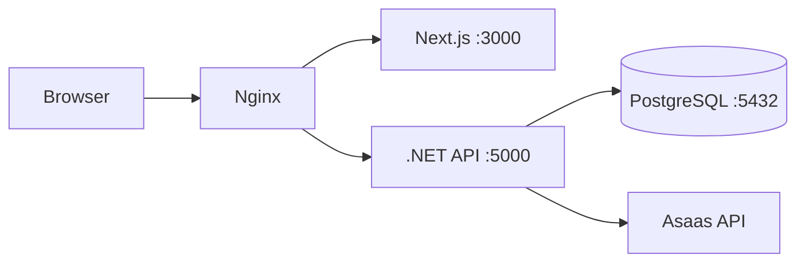

# 🛍️ AllureModa

E-commerce de moda feminina com design premium, construído com .NET 8 e Next.js.


---

## 📋 Índice

- [Visão Geral](#-visão-geral)
- [Arquitetura](#-arquitetura)
- [Tecnologias](#-tecnologias)
- [Requisitos](#-requisitos)
- [Instalação](#-instalação)
- [Configuração](#-configuração)
- [API Reference](#-api-reference)
- [Frontend](#-frontend)
- [Docker](#-docker)
- [Segurança](#-segurança)
- [Deploy](#-deploy)

---

## 🎯 Visão Geral

AllureModa é uma plataforma de e-commerce especializada em moda feminina, com foco em:

- **Design Premium**: Interface elegante com cores suaves (beige, gold, black)
- **Performance**: SSR/SSG com Next.js para carregamento rápido
- **Segurança**: Autenticação JWT, rate limiting, headers de segurança
- **Pagamentos**: Integração com Asaas (PIX, Boleto, Cartão)
- **Administração**: Dashboard completo para gestão de produtos e pedidos

---

## 🏗️ Arquitetura

```
AllureModa/
├── Backend/                 # API .NET 8
│   ├── Controllers/         # Endpoints REST
│   ├── Models/              # Entidades do banco
│   ├── Services/            # Lógica de negócio
│   ├── DTOs/                # Data Transfer Objects
│   └── Data/                # DbContext e Migrations
│
├── frontend/                # Next.js 16 (App Router)
│   ├── src/
│   │   ├── app/             # Rotas e páginas
│   │   │   ├── (shop)/      # Páginas públicas
│   │   │   ├── (auth)/      # Autenticação
│   │   │   └── admin/       # Painel administrativo
│   │   ├── components/      # Componentes React
│   │   └── lib/             # Utilitários
│   └── public/              # Assets estáticos
│
├── nginx/                   # Configuração do proxy reverso
├── docker-compose.yml       # Orquestração de containers
└── .env.example             # Template de variáveis
```

### Comunicação



---

## 🛠️ Tecnologias

### Backend
| Tecnologia | Versão | Uso |
|------------|--------|-----|
| .NET | 8.0 | Framework principal |
| Entity Framework Core | 8.0 | ORM |
| PostgreSQL | 16 | Banco de dados |
| JWT | - | Autenticação |
| BCrypt | - | Hash de senhas |

### Frontend
| Tecnologia | Versão | Uso |
|------------|--------|-----|
| Next.js | 16.1 | Framework React |
| TypeScript | 5.x | Tipagem |
| Tailwind CSS | 4.x | Estilização |
| Lucide React | - | Ícones |

### Infraestrutura
| Tecnologia | Uso |
|------------|-----|
| Docker | Containerização |
| Nginx | Proxy reverso |
| Asaas | Gateway de pagamento |

---

## 📌 Requisitos

### Desenvolvimento Local
- Node.js 20+
- .NET SDK 8.0
- PostgreSQL 15+ (ou Docker)
- Git

### Com Docker
- Docker Desktop 24+
- Docker Compose 2.20+

---

## 🚀 Instalação

### Opção 1: Com Docker (Recomendado)

```bash
# 1. Clone o repositório
git clone https://github.com/seu-usuario/AllureModa.git
cd AllureModa

# 2. Configure as variáveis de ambiente
copy .env.example .env
# Edite o .env com suas configurações

# 3. Inicie os containers
docker.bat dev

# 4. Acesse
# Frontend: http://localhost:3000
# Backend:  http://localhost:5000
# Swagger:  http://localhost:5000/swagger
```

### Opção 2: Desenvolvimento Local

```bash
# Backend
cd Backend
dotnet restore
dotnet ef database update  # Requer PostgreSQL rodando
dotnet run

# Frontend (novo terminal)
cd frontend
npm install
npm run dev
```

---

## ⚙️ Configuração

### Variáveis de Ambiente

Crie um arquivo `.env` na raiz do projeto:

```env
# Database
POSTGRES_USER=alluremoda
POSTGRES_PASSWORD=sua_senha_segura
POSTGRES_DB=alluremoda

# JWT
JWT_SECRET=SuaChaveSecretaMuitoSeguraComMaisDe32Caracteres!
JWT_ISSUER=AllureModa.API
JWT_AUDIENCE=AllureModa.Client

# Asaas (Pagamentos)
ASAAS_API_KEY=sua_api_key_asaas
ASAAS_BASE_URL=https://sandbox.asaas.com/api/v3
ASAAS_WEBHOOK_TOKEN=seu_token_webhook

# Frontend
NEXT_PUBLIC_API_URL=http://localhost:5000/api
```

### Backend (appsettings.json)

```json
{
  "ConnectionStrings": {
    "DefaultConnection": "Host=localhost;Port=5432;Database=alluremoda;Username=alluremoda;Password=senha"
  },
  "JwtSettings": {
    "Secret": "SuaChaveSecreta",
    "ExpirationHours": 24
  },
  "Asaas": {
    "ApiKey": "sua_api_key",
    "BaseUrl": "https://sandbox.asaas.com/api/v3"
  }
}
```

---

## 📡 API Reference

### Autenticação

| Método | Endpoint | Descrição |
|--------|----------|-----------|
| POST | `/api/auth/register` | Registrar usuário |
| POST | `/api/auth/login` | Login |
| GET | `/api/auth/me` | Dados do usuário logado |

### Produtos

| Método | Endpoint | Descrição |
|--------|----------|-----------|
| GET | `/api/products` | Listar produtos |
| GET | `/api/products/slug/:slug` | Produto por slug |
| GET | `/api/categories` | Listar categorias |
| GET | `/api/brands` | Listar marcas |

### Carrinho

| Método | Endpoint | Descrição | Auth |
|--------|----------|-----------|------|
| GET | `/api/cart` | Obter carrinho | ✅ |
| PUT | `/api/cart` | Atualizar item | ✅ |
| DELETE | `/api/cart/items/:id` | Remover item | ✅ |

### Pedidos

| Método | Endpoint | Descrição | Auth |
|--------|----------|-----------|------|
| GET | `/api/orders` | Meus pedidos | ✅ |
| POST | `/api/orders` | Criar pedido | ✅ |
| GET | `/api/orders/:id` | Detalhe do pedido | ✅ |

### Pagamentos

| Método | Endpoint | Descrição | Auth |
|--------|----------|-----------|------|
| POST | `/api/payments` | Criar pagamento | ✅ |
| GET | `/api/payments/:id/pix` | Obter QR Code PIX | ✅ |
| POST | `/api/webhook/asaas` | Webhook Asaas | Token |

### Admin

| Método | Endpoint | Descrição | Role |
|--------|----------|-----------|------|
| GET | `/api/admin/stats` | Dashboard stats | ADMIN |
| GET | `/api/admin/users` | Listar usuários | ADMIN |
| GET | `/api/admin/orders` | Listar pedidos | ADMIN |

---

## 🎨 Frontend

### Rotas

| Rota | Descrição |
|------|-----------|
| `/` | Homepage |
| `/products` | Listagem de produtos |
| `/products/:slug` | Detalhe do produto |
| `/cart` | Carrinho de compras |
| `/login` | Login/Registro |
| `/admin` | Dashboard admin |

### Design System

#### Cores

```css
--color-allure-beige: #F7F3EF;  /* Background principal */
--color-allure-black: #1A1A1A;  /* Texto e footer */
--color-allure-gold: #BFA181;   /* Destaques e CTAs */
--color-allure-grey: #6B7280;   /* Texto secundário */
```

#### Fontes

| Fonte | Uso |
|-------|-----|
| Playfair Display | Títulos e logo |
| Inter | Corpo de texto |
| Dancing Script | Elementos decorativos |

### Componentes Principais

```
components/
├── layout/
│   ├── Navbar.tsx      # Navegação principal
│   └── Footer.tsx      # Rodapé
├── shop/
│   ├── Hero.tsx        # Banner principal
│   ├── ProductCard.tsx # Card de produto
│   ├── FeaturedProducts.tsx
│   └── Mission.tsx     # Seção institucional
```

---

## 🐳 Docker

### Comandos Disponíveis

```bash
# Windows
docker.bat dev      # Ambiente de desenvolvimento
docker.bat prod     # Produção com Nginx
docker.bat build    # Construir imagens
docker.bat logs     # Ver logs
docker.bat down     # Parar serviços
docker.bat clean    # Limpar tudo

# Linux/Mac
make dev
make prod
make build
make logs
make down
make clean
```

### Serviços

| Serviço | Porta | Descrição |
|---------|-------|-----------|
| postgres | 5432 | Banco de dados |
| backend | 5000 | API .NET |
| frontend | 3000 | Next.js |
| nginx | 80/443 | Proxy (produção) |

### Health Checks

Todos os serviços possuem health checks:
- **Backend**: `GET /health`
- **Frontend**: `GET /`
- **PostgreSQL**: `pg_isready`

---

## 🔒 Segurança

### Implementado

| Feature | Descrição |
|---------|-----------|
| JWT Authentication | Tokens com expiração |
| BCrypt | Hash de senhas |
| Rate Limiting | 100/min global, 10/min auth |
| CORS | Restrito ao frontend |
| Security Headers | HSTS, X-Frame-Options, CSP |
| HTTPS | Obrigatório em produção |
| Authorization | Verificação de owner em recursos |

### Headers de Segurança

```
X-Content-Type-Options: nosniff
X-Frame-Options: DENY
X-XSS-Protection: 1; mode=block
Referrer-Policy: strict-origin-when-cross-origin
Strict-Transport-Security: max-age=31536000
Content-Security-Policy: default-src 'self'
```

### Boas Práticas

- ❌ Nunca commite arquivos `.env`
- ✅ Use senhas fortes para JWT e banco
- ✅ Configure HTTPS em produção
- ✅ Mantenha dependências atualizadas

---

## 🚢 Deploy

### Requisitos de Produção

- VPS com 2GB+ RAM
- Docker e Docker Compose
- Domínio configurado
- Certificado SSL

### Deploy com Docker

```bash
# 1. Clone no servidor
git clone https://github.com/seu-usuario/AllureModa.git
cd AllureModa

# 2. Configure produção
cp .env.example .env
nano .env  # Configure com valores de produção

# 3. Inicie em modo produção
docker-compose --profile production up -d

# 4. Configure SSL (Let's Encrypt)
# Adicione certificados em nginx/ssl/
```

### Variáveis de Produção

```env
ASPNETCORE_ENVIRONMENT=Production
NODE_ENV=production
ASAAS_BASE_URL=https://api.asaas.com/api/v3  # URL de produção!
```

---

## 📄 Licença

Este projeto é proprietário. Todos os direitos reservados.

---

## 👥 Contato

- **Desenvolvedor**: Felipe Gonçalves
- **Email**: contato@alluremoda.com.br

---

<p align="center">
  Feito com ❤️ para AllureModa
</p>
