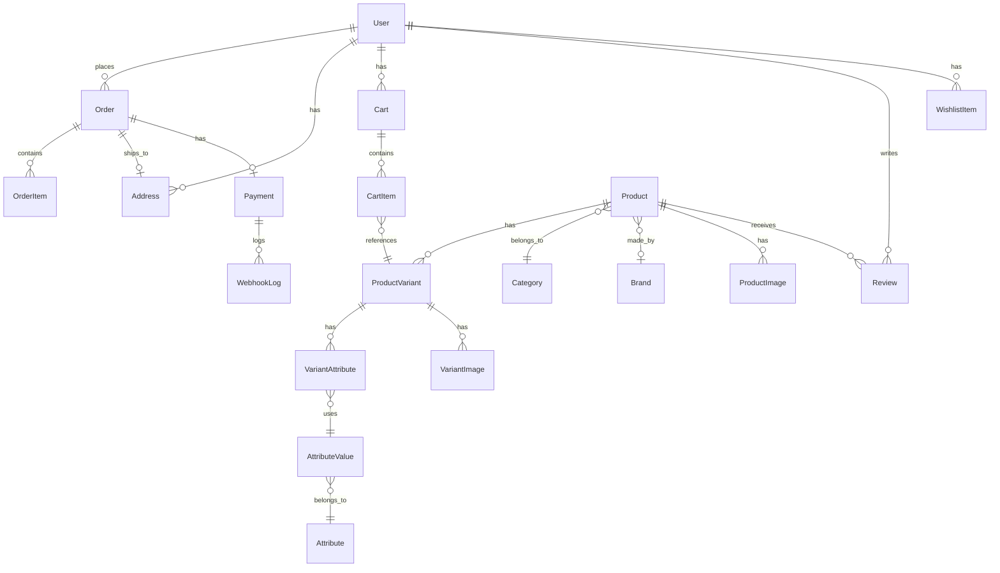

# 🗄️ Database Schema

## Entity Relationship Diagram



---

## Tables

### User

| Column | Type | Constraints |
|--------|------|-------------|
| Id | UUID | PK |
| Email | VARCHAR(255) | UNIQUE, NOT NULL |
| PasswordHash | VARCHAR(255) | NOT NULL |
| FirstName | VARCHAR(100) | NOT NULL |
| LastName | VARCHAR(100) | NOT NULL |
| Phone | VARCHAR(20) | |
| Cpf | VARCHAR(14) | UNIQUE |
| Role | ENUM | DEFAULT 'USER' |
| CreatedAt | TIMESTAMP | DEFAULT NOW() |
| UpdatedAt | TIMESTAMP | |

**Role Enum:** `USER`, `ADMIN`

---

### Product

| Column | Type | Constraints |
|--------|------|-------------|
| Id | UUID | PK |
| TenantId | UUID | INDEX |
| Name | VARCHAR(255) | NOT NULL |
| Slug | VARCHAR(255) | UNIQUE, NOT NULL |
| Description | TEXT | |
| BasePrice | DECIMAL(10,2) | NOT NULL |
| PromotionalPrice | DECIMAL(10,2) | |
| CategoryId | UUID | FK |
| BrandId | UUID | FK |
| IsActive | BOOLEAN | DEFAULT true |
| CreatedAt | TIMESTAMP | DEFAULT NOW() |

---

### ProductVariant

| Column | Type | Constraints |
|--------|------|-------------|
| Id | UUID | PK |
| ProductId | UUID | FK, NOT NULL |
| Sku | VARCHAR(50) | UNIQUE |
| Price | DECIMAL(10,2) | |
| Stock | INT | DEFAULT 0 |
| IsActive | BOOLEAN | DEFAULT true |

---

### Attribute

| Column | Type | Constraints |
|--------|------|-------------|
| Id | UUID | PK |
| Name | VARCHAR(50) | UNIQUE, NOT NULL |

**Examples:** "Cor", "Tamanho"

---

### AttributeValue

| Column | Type | Constraints |
|--------|------|-------------|
| Id | UUID | PK |
| AttributeId | UUID | FK, NOT NULL |
| Value | VARCHAR(100) | NOT NULL |
| Meta | VARCHAR(50) | |

**Meta:** Usado para hex de cores (#FF0000)

---

### Category

| Column | Type | Constraints |
|--------|------|-------------|
| Id | UUID | PK |
| Name | VARCHAR(100) | NOT NULL |
| Slug | VARCHAR(100) | UNIQUE |
| Description | TEXT | |
| ImageUrl | VARCHAR(500) | |

---

### Brand

| Column | Type | Constraints |
|--------|------|-------------|
| Id | UUID | PK |
| Name | VARCHAR(100) | NOT NULL |
| Slug | VARCHAR(100) | UNIQUE |
| LogoUrl | VARCHAR(500) | |

---

### Order

| Column | Type | Constraints |
|--------|------|-------------|
| Id | UUID | PK |
| UserId | UUID | FK, NOT NULL |
| Status | ENUM | DEFAULT 'PENDING' |
| TotalPrice | DECIMAL(10,2) | NOT NULL |
| ShippingAddressId | UUID | FK |
| CreatedAt | TIMESTAMP | DEFAULT NOW() |
| UpdatedAt | TIMESTAMP | |

**Status Enum:** `PENDING`, `PAID`, `PROCESSING`, `SHIPPED`, `DELIVERED`, `CANCELLED`

---

### OrderItem

| Column | Type | Constraints |
|--------|------|-------------|
| Id | UUID | PK |
| OrderId | UUID | FK, NOT NULL |
| ProductVariantId | UUID | FK, NOT NULL |
| Quantity | INT | NOT NULL |
| UnitPrice | DECIMAL(10,2) | NOT NULL |

---

### Payment

| Column | Type | Constraints |
|--------|------|-------------|
| Id | UUID | PK |
| OrderId | UUID | FK, NOT NULL |
| AsaasPaymentId | VARCHAR(100) | UNIQUE |
| AsaasCustomerId | VARCHAR(100) | |
| Method | ENUM | NOT NULL |
| Status | ENUM | DEFAULT 'PENDING' |
| Value | DECIMAL(10,2) | NOT NULL |
| DueDate | DATE | |
| PaidAt | TIMESTAMP | |
| CreatedAt | TIMESTAMP | DEFAULT NOW() |

**Method Enum:** `PIX`, `BOLETO`, `CREDIT_CARD`
**Status Enum:** `PENDING`, `CONFIRMED`, `RECEIVED`, `OVERDUE`, `REFUNDED`, `FAILED`

---

### Address

| Column | Type | Constraints |
|--------|------|-------------|
| Id | UUID | PK |
| UserId | UUID | FK, NOT NULL |
| Type | ENUM | DEFAULT 'SHIPPING' |
| PostalCode | VARCHAR(10) | NOT NULL |
| Street | VARCHAR(255) | NOT NULL |
| Number | VARCHAR(20) | |
| AddressLine2 | VARCHAR(100) | |
| Neighborhood | VARCHAR(100) | |
| City | VARCHAR(100) | NOT NULL |
| State | VARCHAR(50) | NOT NULL |
| Country | VARCHAR(50) | DEFAULT 'Brazil' |
| IsDefault | BOOLEAN | DEFAULT false |

**Type Enum:** `SHIPPING`, `BILLING`

---

### Cart

| Column | Type | Constraints |
|--------|------|-------------|
| Id | UUID | PK |
| UserId | UUID | FK, UNIQUE |
| CreatedAt | TIMESTAMP | DEFAULT NOW() |
| UpdatedAt | TIMESTAMP | |

---

### CartItem

| Column | Type | Constraints |
|--------|------|-------------|
| Id | UUID | PK |
| CartId | UUID | FK, NOT NULL |
| ProductVariantId | UUID | FK, NOT NULL |
| Quantity | INT | NOT NULL |

---

### Review

| Column | Type | Constraints |
|--------|------|-------------|
| Id | UUID | PK |
| ProductId | UUID | FK, NOT NULL |
| UserId | UUID | FK, NOT NULL |
| Rating | INT | CHECK 1-5 |
| Comment | TEXT | |
| CreatedAt | TIMESTAMP | DEFAULT NOW() |

---

### WishlistItem

| Column | Type | Constraints |
|--------|------|-------------|
| Id | UUID | PK |
| UserId | UUID | FK, NOT NULL |
| ProductId | UUID | FK, NOT NULL |
| CreatedAt | TIMESTAMP | DEFAULT NOW() |

**Unique:** (UserId, ProductId)

---

### WebhookLog

| Column | Type | Constraints |
|--------|------|-------------|
| Id | UUID | PK |
| PaymentId | UUID | FK |
| Event | VARCHAR(100) | NOT NULL |
| Payload | JSONB | NOT NULL |
| ProcessedAt | TIMESTAMP | DEFAULT NOW() |

---

## Indexes

```sql
-- Performance indexes
CREATE INDEX idx_products_category ON products(category_id);
CREATE INDEX idx_products_brand ON products(brand_id);
CREATE INDEX idx_products_tenant ON products(tenant_id);
CREATE INDEX idx_products_slug ON products(slug);

CREATE INDEX idx_orders_user ON orders(user_id);
CREATE INDEX idx_orders_status ON orders(status);
CREATE INDEX idx_orders_created ON orders(created_at DESC);

CREATE INDEX idx_payments_order ON payments(order_id);
CREATE INDEX idx_payments_asaas ON payments(asaas_payment_id);

CREATE INDEX idx_cart_user ON carts(user_id);
```

---

## Migrations

Execute com Entity Framework:

```bash
cd Backend
dotnet ef migrations add InitialCreate
dotnet ef database update
```

Ou via Docker:

```bash
docker-compose exec backend dotnet ef database update
```
